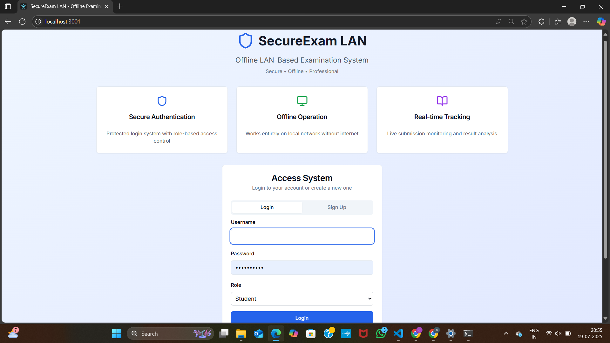
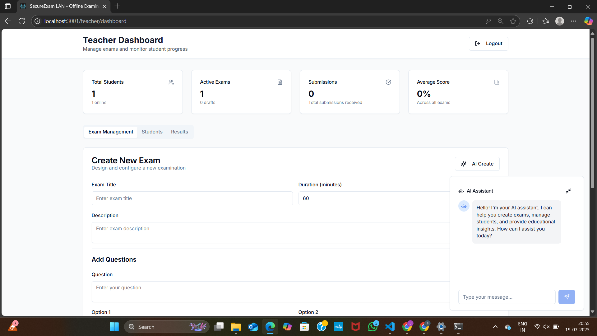
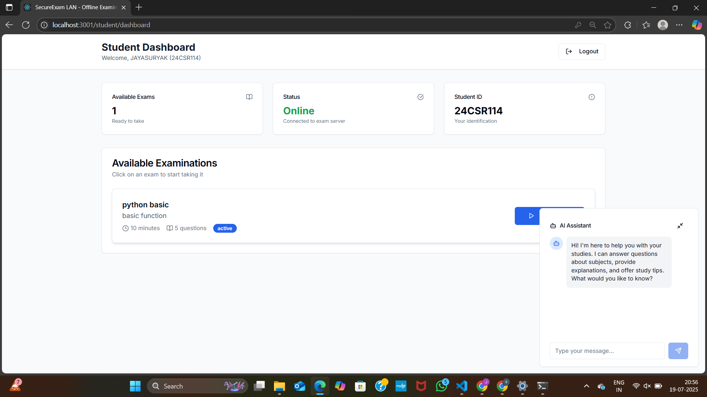

# AI-Powered MCQ Exam System  A modern, AI-powered Multiple Choice Question (MCQ) exam system built with Next.js, React, and local LLM integration using Ollama. This system allows teachers to create AI-generated exams and students to take them in a secure, timed environment.



## Features

### 🎓 For Teachers
- **AI-Powered Question Generation**: Automatically generate MCQ questions using local LLM
- **Exam Management**: Create, edit, and manage exams with ease
- **Real-time Monitoring**: Monitor student progress during exams
- **Detailed Analytics**: View comprehensive exam results and statistics
- **Flexible Configuration**: Set exam duration, difficulty levels, and question counts



### 📚 For Students
- **Intuitive Exam Interface**: Clean, distraction-free exam taking experience
- **Real-time Timer**: Visual countdown timer with automatic submission
- **Question Navigation**: Easy navigation between questions with progress tracking
- **Instant Results**: View scores and performance immediately after submission
- **AI Chat Support**: Get help from AI assistant during studies



### 🤖 AI Integration
- **Local LLM Support**: Uses Ollama for privacy-focused AI question generation
- **Multiple Difficulty Levels**: Easy, Medium, and Hard question generation
- **Subject Flexibility**: Generate questions for any subject or topic
- **Quality Assurance**: AI-generated questions include explanations and validation

## Technology Stack

- **Frontend**: Next.js 14, React 18, TypeScript
- **Styling**: Tailwind CSS, shadcn/ui components
- **AI Integration**: Ollama (Local LLM)
- **Authentication**: JWT-based authentication
- **Database**: MongoDB (configurable) 

## Prerequisites

Before running this application, make sure you have:

- Node.js 18+ installed
- Ollama installed and running locally
- A compatible LLM model (e.g., llama3.2, mistral, etc.)

### Installing Ollama

1. Visit [Ollama's official website](https://ollama.ai) and download the installer
2. Install Ollama on your system
3. Pull a compatible model:
   ```bash
   ollama pull llama3.2
   ```
4. Start the Ollama service:
   ```bash
   ollama serve
   ```

## Installation

1. **Clone the repository**
   ```bash
   git clone 
   cd smart-exam-LAN-without-internet
   ```

2. **Install dependencies**
   ```bash
   npm install
   # or
   yarn install
   # or
   pnpm install
   ```

3. **Set up environment variables**
   
   Create a `.env.local` file in the root directory and add the following variables:
   
   ```env
   # Ollama Configuration
   OLLAMA_BASE_URL=http://localhost:11434
   OLLAMA_MODEL=llama3.2
   
   # Database Configuration
   MONGODB_URI=mongodb://localhost:27017/exam-system
   
   # Authentication
   JWT_SECRET=your-super-secret-jwt-key-here
   NEXTAUTH_SECRET=your-nextauth-secret-here
   NEXTAUTH_URL=http://localhost:3000
   
   # Application Configuration
   NODE_ENV=development
   ```

4. **Start the development server**
   ```bash
   npm run build
   npm run dev
   # or
   yarn dev
   # or
   pnpm dev
   ```

5. **Open your browser**
   
   Navigate to [http://localhost:3000](http://localhost:3000) to see the application.

## Network Setup for Multi-Device Access (Offline)

### 🏫 Teacher PC Setup (Host Machine)

Follow these steps to set up the teacher's PC as the host and allow student devices to connect via hotspot or LAN:

#### Step 1: Get Your Current IP Address

**For Windows:**
```cmd
ipconfig
```
Look for your IPv4 address under your active network adapter (usually starts with 192.168.x.x or 10.x.x.x)

**For macOS/Linux:**
```bash
ifconfig
# or
ip addr show
```

**Alternative for all platforms:**
```bash
# Using Node.js (if installed)
node -e "console.log(require('os').networkInterfaces())"
```

#### Step 2: Configure Next.js for Network Access

1. **Update your package.json scripts** to bind to all network interfaces:
   ```json
   {
     "scripts": {
       "dev": "next dev -H 0.0.0.0 -p 3001",
       "start": "next start -H 0.0.0.0 -p 3001"
     }
   }
   ```

2. **Update your .env.local file** with your actual IP address:
   ```env
   # Replace with your actual IP address from ipconfig
   NEXTAUTH_URL=http://192.168.1.100:3001
   
   # Other configurations remain same
   OLLAMA_BASE_URL=http://localhost:11434
   OLLAMA_MODEL=llama3.2
   MONGODB_URI=mongodb://localhost:27017/exam-system
   JWT_SECRET=your-super-secret-jwt-key-here
   NEXTAUTH_SECRET=your-nextauth-secret-here
   NODE_ENV=development
   ```

#### Step 3: Configure Windows Firewall (Windows Users)

1. Open Windows Defender Firewall
2. Click "Allow an app or feature through Windows Defender Firewall"
3. Click "Change Settings" → "Allow another app"
4. Browse and select Node.js or manually add port 3001
5. Check both "Private" and "Public" networks
6. Click OK

**Alternative: Add firewall rule via Command Prompt (Run as Administrator):**
```cmd
netsh advfirewall firewall add rule name="MCQ Exam System" dir=in action=allow protocol=TCP localport=3001
```

#### Step 4: Start the Application
```bash
npm run dev
```

The application will now be accessible at:
- **Teacher PC (Host)**: http://localhost:3001
- **Student Devices**: http://YOUR_IP_ADDRESS:3001

### 📱 Student Device Setup

#### Method 1: WiFi Hotspot Connection

1. **Create WiFi Hotspot from Teacher PC:**
   - Windows: Settings → Network & Internet → Mobile hotspot → Turn on
   - macOS: System Preferences → Sharing → Internet Sharing
   - Set network name and password

2. **Connect Student Devices:**
   - Connect student laptops/tablets to the WiFi hotspot
   - Open browser and navigate to: `http://192.168.x.x:3001` (replace with teacher's IP)

#### Method 2: LAN Cable Connection

1. **Connect via Ethernet:**
   - Use a network switch/router to connect multiple devices
   - Or use direct ethernet connection between two devices

2. **Access the Application:**
   - Find the teacher PC's IP address on the network
   - Open browser and go to: `http://TEACHER_IP:3001`


## Environment Variables

### Required Variables

| Variable | Description | Example |
|----------|-------------|---------|
| `OLLAMA_BASE_URL` | URL where Ollama service is running | `http://localhost:11434` |
| `OLLAMA_MODEL` | LLM model to use for question generation | `llama3.2` |
| `MONGODB_URI` | MongoDB connection string | `mongodb://localhost:27017/exam-system` |
| `JWT_SECRET` | Secret key for JWT token signing | `your-super-secret-jwt-key` |

### Optional Variables

| Variable | Description | Default |
|----------|-------------|---------|
| `NEXTAUTH_SECRET` | NextAuth.js secret for session encryption | Auto-generated |
| `NEXTAUTH_URL` | Base URL for authentication callbacks | `http://localhost:3000` |
| `NODE_ENV` | Environment mode | `development` |


### For Teachers

1. **Register/Login** as a teacher
2. **Create New Exam**:
   - Fill in exam details (title, description, duration)
   - Specify subject and difficulty level
   - Set number of questions
   - Click "Generate MCQ Exam with AI"
3. **Review Generated Questions**:
   - Preview all generated questions
   - Remove unwanted questions if needed
   - Click "Create Exam" to finalize
4. **Manage Exams**:
   - Activate/deactivate exams
   - Monitor student progress
   - View detailed results and analytics

### For Students

1. **Register/Login** as a student
2. **View Available Exams** on the dashboard
3. **Start Exam**:
   - Click "Start Exam" on any available exam
   - Read instructions carefully
   - Answer questions within the time limit
4. **Submit Exam**:
   - Review answers using question navigation
   - Submit before time runs out
   - View results immediately

## API Endpoints

### Authentication
- `POST /api/auth/register` - User registration
- `POST /api/auth/login` - User login
- `POST /api/auth/logout` - User logout

### AI Integration
- `POST /api/ai/generate-questions` - Generate MCQ questions
- `POST /api/ai/chat` - AI chat assistance

### Exam Management
- `GET /api/exams` - Get all exams (teacher)
- `POST /api/exams` - Create new exam
- `GET /api/exams/available` - Get available exams (student)
- `PUT /api/exams/:id` - Update exam
- `DELETE /api/exams/:id` - Delete exam

### Submissions
- `POST /api/submissions` - Submit exam answers
- `GET /api/submissions/student` - Get student submissions
- `GET /api/submissions/exam/:id` - Get exam submissions (teacher)


## Troubleshooting

### Common Issues

1. **"Failed to generate questions"**
   - Ensure Ollama is running: `ollama serve`
   - Check if the model is available: `ollama list`
   - Verify `OLLAMA_BASE_URL` in `.env.local`

2. **Connection refused errors**
   - Check if Ollama is accessible at the configured URL
   - Try: `curl http://localhost:11434/api/version`

3. **Model not found**
   - Pull the required model: `ollama pull llama3.2`
   - Update `OLLAMA_MODEL` in `.env.local`

4. **Authentication issues**
   - Verify `JWT_SECRET` is set
   - Clear browser cookies and try again

5. **Network Access Issues**
   - Ensure firewall allows port 3001
   - Check that you're using the correct IP address
   - Verify all devices are on the same network
   - Try accessing `http://TEACHER_IP:3001` from student device

6. **Students can't connect**
   - Run `ipconfig` again to confirm IP hasn't changed
   - Check Windows Defender Firewall settings
   - Ensure hotspot/network sharing is active
   - Verify port 3001 is not blocked by antivirus

### Performance Tips

- Use faster models like `llama3.2:8b` for better response times
- Adjust Ollama's `num_ctx` parameter for longer contexts
- Consider using GPU acceleration for Ollama
- For better network performance, use wired connections when possible

### Network Troubleshooting

**Test connectivity between devices:**
```bash
# On student device, test if teacher PC is reachable
ping 192.168.1.100

# Test if port 3001 is accessible
telnet 192.168.1.100 3001
```

**Check if service is listening on all interfaces:**
```bash
# Windows
netstat -an | findstr :3001

# macOS/Linux
netstat -an | grep :3001
```

## Contributing

1. Fork the repository
2. Create a feature branch: `git checkout -b feature/new-feature`
3. Commit changes: `git commit -am 'Add new feature'`
4. Push to branch: `git push origin feature/new-feature`
5. Submit a Pull Request

## License

This project is licensed under the MIT License - see the [LICENSE](LICENSE) file for details.

## Support

For support and questions:
- Create an issue on GitHub
- Check the troubleshooting section above
- Review Ollama documentation for LLM-related issues

## Acknowledgments

- [Ollama](https://ollama.ai) for local LLM integration
- [shadcn/ui](https://ui.shadcn.com) for beautiful UI components
- [Next.js](https://nextjs.org) for the amazing React framework
- [Tailwind CSS](https://tailwindcss.com) for utility-first styling
